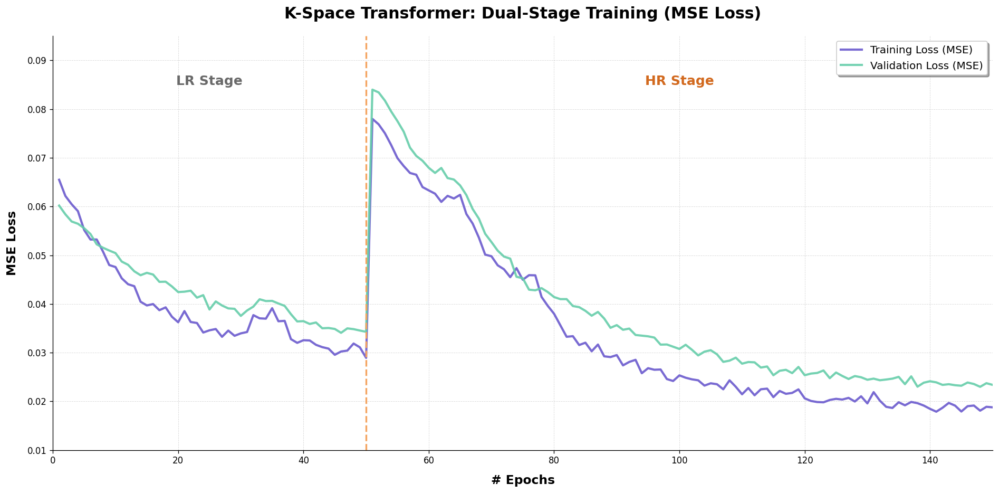
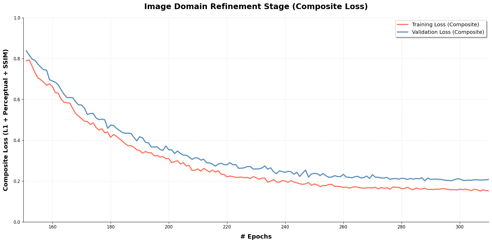

# A K-Space Deep Learning Model for Breast MRI Super-Resolution to Enhance Diagnostic Quality

**Authors:** Weerasinghe M.S.S , Jayasinghe C.H , Jayasooriya J.M.D.C

**Supervisors:** Dr. Charith Chitraranjan (internal), Dr. Isuru Wijesinghe (external)

---

## Abstract

Magnetic Resonance Imaging (MRI) is essential for breast cancer diagnosis, but high-resolution scans require long acquisition times that increase patient discomfort and motion artifact risk. K-space undersampling reduces scan duration but introduces aliasing artifacts and loss of diagnostic detail. Convolutional Neural Networks (CNNs), while effective in image-domain reconstruction, are poorly suited to k-space data because they rely on local receptive fields and translation invariance, whereas MRI artifacts are global frequency-domain phenomena. This work implements a K-Space Transformer that treats undersampled MRI reconstruction as a coordinate-query problem in frequency space, using Implicit Neural Representation (INR) with sinusoidal positional encoding, a hierarchical Low-Resolution (LR) to High-Resolution (HR) decoder, and an image-domain CNN refinement module with k-space data consistency. The model is trained on T1-weighted fat-saturated breast MRI from the Duke Breast MRI dataset (50 patients, 320×320 k-space) under retrospective undersampling at acceleration factors ×3, x5, x7,×10. A three-stage training schedule (LR → HR → refinement) with dual-domain deep supervision converges stably despite loss spikes at stage transitions. Quantitative evaluation against OUCR and SwinMR baselines shows that the hybrid model with image-domain refinement achieves the best PSNR and SSIM at all tested acceleration factors (e.g., PSNR 32.43 dB and SSIM 0.9594 at ×10), outperforming OUCR on SSIM across all factors and on PSNR at moderate accelerations (×3–×7). Qualitative results confirm effective artifact removal and restoration of fibroglandular tissue detail. These findings demonstrate that hybrid k-space and image-domain modeling is a strong direction for clinically useful accelerated breast MRI reconstruction.

---

## Table of Contents

- [1. Introduction](#1-introduction)
- [2. Related Work](#2-related-work)
- [3. Methodology](#3-methodology)
  - [3.1 Dataset and Preprocessing](#31-dataset-and-preprocessing)
  - [3.2 K-Space Tokenization](#32-k-space-tokenization)
  - [3.3 Model Architecture](#33-model-architecture)
  - [3.4 Training Strategy and Loss Functions](#34-training-strategy-and-loss-functions)
- [4. Implementation](#4-implementation)
- [5. Experiments and Results](#5-experiments-and-results)
  - [5.1 Experimental Setup](#51-experimental-setup)
  - [5.2 Quantitative Results](#52-quantitative-results)
  - [5.3 Training Dynamics](#53-training-dynamics)
  - [5.4 Qualitative Results](#54-qualitative-results)
- [6. Discussion and Conclusion](#6-discussion-and-conclusion)
- [7. Code vs Research Configuration](#7-code-vs-research-configuration)
- [8. Reproducibility and Usage](#8-reproducibility-and-usage)
- [9. References](#9-references)

---

## 1. Introduction

Breast cancer remains the most prevalent cancer among women globally, and Magnetic Resonance Imaging (MRI) serves as a cornerstone for diagnosis in high-risk patients. MRI provides high-resolution, radiation-free images with excellent soft-tissue contrast, but the lengthy scan times required for detailed breast imaging often exceed one hour, leading to patient discomfort and increased susceptibility to motion artifacts. Accelerated acquisition via k-space undersampling can reduce scan times to under 20 minutes, but it transforms image reconstruction into an ill-posed inverse problem. Incomplete k-space coverage causes aliasing artifacts and loss of fine anatomical detail critical for distinguishing benign from malignant lesions.

The fundamental relationship between k-space and the image domain is expressed as $x = \mathcal{F}^{-1}(k)$, where $x$ is the reconstructed image, $\mathcal{F}^{-1}$ is the inverse Fourier transform, and $k$ is the k-space data. Central k-space regions encode low spatial frequencies (contrast and signal to noise ratio), while peripheral regions capture high frequencies (spatial resolution and fine detail). Undersampling patterns therefore directly influence the balance between contrast preservation and detail retention.

Traditional reconstruction methods such as Parallel Imaging (SENSE, GRAPPA) and Compressed Sensing (CS) are limited by fixed mathematical priors and struggle under high acceleration factors. Deep Learning (DL) has emerged as a powerful alternative, but the majority of existing models particularly CNN based U-Nets operate in the image domain. CNNs rely on local receptive fields and the assumption of translation invariance, which are suboptimal for k-space data where spatial information is distributed across frequency components and accurate reconstruction requires capturing long range dependencies between distant frequency bins.

This research addresses this gap by implementing a K-Space Transformer framework tailored for breast MRI reconstruction. The model adopts an Implicit Neural Representation (INR), treating the k-space spectrogram as a continuous function where spatial coordinates are queried to reconstruct missing frequency data. Global self attention mechanisms capture non local dependencies essential for aliasing artifact removal. To manage computational complexity, a hierarchical decoder structure processes data through LR and HR stages, recovering both anatomical structure and fine lesion morphology. An image-domain refinement module with k-space data consistency further restores local spatial detail that pure frequency-domain decoding cannot fully capture.

The scope of this work is limited to T1-weighted fat-saturated breast MRI central slices from the Duke Breast MRI dataset, evaluated at acceleration factors ×3, ×5, ×7, and ×10 using Peak Signal-to-Noise Ratio (PSNR) and Structural Similarity Index (SSIM) metrics against OUCR and SwinMR baselines.

<p align="center">
  
</p>

<div align="center" style="padding: 0 0 40px 0;">
  <i>Figure 1. Reconstruction method families and typical acceleration ranges.</i>
</div>

---

## 2. Related Work

Deep learning for MRI reconstruction has progressed through several architectural paradigms, each with distinct tradeoffs for breast imaging applications.

**Convolutional approaches.** CNN-based methods, particularly U-Net architectures with encoder-decoder structures and skip connections, form the foundation of modern DL MRI reconstruction. Residual learning, attention mechanisms, and dual-domain networks that alternate between k-space and image processing have extended CNN capabilities. However, CNNs remain fundamentally constrained by local receptive fields when applied directly to k-space data.

**Transformer approaches.** Vision Transformers (ViTs) and specialized MRI reconstruction transformers such as ReconFormer enable superior modeling of long-range dependencies through self-attention. The K-Space Transformer treats k-space coordinates as continuous query points with sinusoidal positional encoding, moving beyond discrete grid constraints. SwinMR applies shifted-window attention for efficient high-resolution MRI reconstruction.

**Hybrid k-space and image-domain methods.** Purely k-space or latent-domain transformers often produce residual artifacts and loss of fine anatomical detail. Hybrid strategies that combine frequency-domain processing with image-domain refinement, exemplified by Deep Cascade CNNs (DC-CNN), Variational Networks and SwinMR variants demonstrate that alternating k-space consistency enforcement with spatial-domain correction improves reconstruction quality under aggressive undersampling.

**Breast MRI-specific gap.** Despite progress in general MRI reconstruction, breast MRI remains underrepresented in the DL landscape. The unique characteristics of breast tissue dense fibroglandular structures, variable breast density patterns, and spatial heterogeneity, introduce domain-specific challenges that generic models inadequately address. Data scarcity (the fastMRI dataset contains only 300 3D breast scans) and limited investigation of hybrid architectures for 2D k-space breast MRI protocols further constrain specialized model development.

This work contributes a breast-specific K-Space Transformer with hierarchical decoding and image-domain refinement, evaluated comprehensively against established baselines across multiple acceleration factors.

---

## 3. Methodology

### 3.1 Dataset and Preprocessing

**Data source.** The Duke Breast MRI dataset comprises complex, 3D dynamic contrast-enhanced volumes from 50 patients. Central slices from T1-weighted fat-saturated sequences were extracted to ensure representative balance of fibroglandular tissue and fatty background while minimizing coil sensitivity profile effects at volume edges.

**Preprocessing pipeline.** Raw MRI data in H5 format undergoes four stages before training:

1. **K-space extraction and normalization.** K-space data is center-cropped to 320×320 pixels, converted from complex values to 2-channel `[real, imaginary]` representation, transformed to image domain via centered IFFT, per-slice normalized to zero mean and unit variance $\text{normalized} = (\text{image} - \mu) / \sigma$, transformed back to k-space via FFT, and filtered by variance (lowest 20% variance slices removed). Output: `k_data.npy` with shape `[N, 320, 320, 2]`.

2. **Low-resolution generation.** HR k-space is converted to image domain (IFFT), downsampled via 2× average pooling (stride 2), and converted back to k-space (FFT). Output: `LR_k_data.npy` with shape `[N, 160, 160, 2]`.

3. **Undersampling mask generation.** Six clinically relevant mask types are generated with stochastic variation: Cartesian equispaced, Cartesian random, variable-density Cartesian, uniform radial, variable-density radial, and spiral. All masks fully sample central k-space (~8% of lines). Output: `combined_masks.npy` with shape `[60, 320, 320]`.

4. **Dataset partitioning.** Data is split 70% training, 15% validation, and 15% test at the patient level with identical HR/LR correspondence across splits.

In-repo tooling covers stages 2 and 4 via `kst-preprocess` and `kst-split`. Raw H5 extraction and mask generation are performed externally.

<!--  -->
<p align="center">
  
</p>
<div align="center">
  <i>Figure 2. End-to-end preprocessing pipeline: raw H5 → k_data.npy → LR_k_data.npy → combined_masks.npy → train/valid/test splits.</i>
</div>

#### &nbsp;

<!--  -->
<p align="center">
  
</p>
<div align="center">
  <i>Figure 3. Low-resolution k-space generation: HR k-space → IFFT → 2× average pooling → FFT.</i>
</div>

#### &nbsp;

<table align="center" border="1" style="border-collapse: collapse; text-align: center; width: 100%; max-width: 800px;">
  <thead>
    <tr style="background-color: #f2f2f2;">
      <th style="padding: 10px; border: 1px solid #ddd; text-align: left;">Array</th>
      <th style="padding: 10px; border: 1px solid #ddd;">Shape</th>
      <th style="padding: 10px; border: 1px solid #ddd; text-align: left;">Description</th>
    </tr>
  </thead>
  <tbody>
    <tr>
      <td style="padding: 10px; border: 1px solid #ddd; text-align: left;">HR k-space</td>
      <td style="padding: 10px; border: 1px solid #ddd;"><code>[N, 320, 320, 2]</code></td>
      <td style="padding: 10px; border: 1px solid #ddd; text-align: left;">Fully sampled ground truth</td>
    </tr>
    <tr>
      <td style="padding: 10px; border: 1px solid #ddd; text-align: left;">LR k-space</td>
      <td style="padding: 10px; border: 1px solid #ddd;"><code>[N, 160, 160, 2]</code></td>
      <td style="padding: 10px; border: 1px solid #ddd; text-align: left;">Coarse supervision target</td>
    </tr>
    <tr>
      <td style="padding: 10px; border: 1px solid #ddd; text-align: left;">Mask bank</td>
      <td style="padding: 10px; border: 1px solid #ddd;"><code>[60, 320, 320]</code></td>
      <td style="padding: 10px; border: 1px solid #ddd; text-align: left;">Retrospective undersampling patterns</td>
    </tr>
  </tbody>
</table>

Split outputs: `train_k.npy`, `valid_k.npy`, `test_k.npy`, corresponding `*_lr_k.npy` files, and `split_indices.npz`.

### 3.2 K-Space Tokenization

Unlike CNNs that ingest fixed grids, the K-Space Transformer processes a sequence of available k-space points. For each training sample, a random undersampling mask is applied to HR k-space. Sampled points and their 2D spatial frequency coordinates form encoder input tokens; unsampled coordinates serve as HR decoder queries.

Each token is defined as a tuple $(v, p)$ where $v$ is the sampled complex value (real/imaginary channels) and $p$ is the normalized 2D coordinate in $[0,1] \times [0,1]$. Sinusoidal positional encoding with `magnify=250` is applied to coordinates before summation with the MLP embedding of k-space values. This coordinate based tokenization supports non-Cartesian and arbitrary sampling patterns dynamically.

Variable-length token sequences are truncated to `max_seq_len=8000` and padded by `KSpaceCollator` for batch processing. Masks are randomly reassigned during training (default: every epoch) for data augmentation. Implementation: [`data/tokenize.py`](data/tokenize.py), [`data/datasets.py`](data/datasets.py).

### 3.3 Model Architecture

The `KSpaceTransformer` model ([`model/transformer.py`](model/transformer.py)) learns a continuous function mapping spatial coordinates to k-space values, conditioned on observed samples.

**Encoder (4 layers, $d_\text{model}=256$, 4 heads).** Sampled k-space values are embedded via a learnable MLP and summed with sinusoidal positional encoding. Four transformer encoder layers apply multi-head self-attention (MHSA) and feed-forward networks (FFN) with residual connections, capturing global dependencies between frequency bins critical for aliasing artifact modeling.

**LR Decoder (4 layers).** Queries are generated from normalized positional coordinates of a 64×64 downsampled grid (`lr_size=64`). Each layer applies multi-head cross-attention (MHCA) to encoder memory followed by MHSA. Per-layer complex value predictions are reshaped and transformed via IFFT to image-domain outputs with deep supervision at each layer.

**HR Decoder (6 layers).** Upsampled LR decoder output serves as context (key/value). To minimize memory consumption, HR layers retain only cross-attention and FFN (no self-attention). Unsampled k-space coordinates are queried to predict complex values, inserted into masked k-space via `fill_in_k()`, and transformed to image domain via IFFT at each layer.

**Image-Domain Refinement Module (RM stage).** Active only during the refinement training stage, this module receives HR decoder output, applies differentiable IFFT, processes through a CNN stack (LeakyReLU activations, 64 mid-channels, 3×3 kernels), and transforms back to k-space via FFT. Data consistency is enforced: $k_\text{out} = k_\text{rec} \odot m + k_\text{sampled}$, where $m$ is the undersampling mask. Refined output is fed back into the next HR layer via `conv_weight`-scaled embedding. Implementation: [`model/blocks.py`](model/blocks.py).

<!--  -->
<p align="center">
  
</p>
<div align="center">
  <i>Figure 4. Encoder: MLP embedding + positional encoding → N× self-attention layers.</i>
</div>

#### &nbsp;

<!--  -->
<p align="center">
  
</p>
<div align="center">
  <i>Figure 5. Hierarchical decoder: 1. LR decoder (cross+self-attention) 2. HR decoder (cross-attention + refinement module).</i>
</div>

#### &nbsp;

<table align="center" border="1" style="border-collapse: collapse; text-align: center; width: 100%; max-width: 600px;">
  <thead>
    <tr style="background-color: #f2f2f2;">
      <th style="padding: 10px; border: 1px solid #ddd; text-align: left;">Parameter</th>
      <th style="padding: 10px; border: 1px solid #ddd;">Default</th>
    </tr>
  </thead>
  <tbody>
    <tr>
      <td style="padding: 10px; border: 1px solid #ddd; text-align: left;"><code>d_model</code></td>
      <td style="padding: 10px; border: 1px solid #ddd;">256</td>
    </tr>
    <tr>
      <td style="padding: 10px; border: 1px solid #ddd; text-align: left;"><code>n_head</code></td>
      <td style="padding: 10px; border: 1px solid #ddd;">4</td>
    </tr>
    <tr>
      <td style="padding: 10px; border: 1px solid #ddd; text-align: left;">Encoder / LR / HR layers</td>
      <td style="padding: 10px; border: 1px solid #ddd;">4 / 4 / 6</td>
    </tr>
    <tr>
      <td style="padding: 10px; border: 1px solid #ddd; text-align: left;"><code>dim_feedforward</code></td>
      <td style="padding: 10px; border: 1px solid #ddd;">1024</td>
    </tr>
    <tr>
      <td style="padding: 10px; border: 1px solid #ddd; text-align: left;"><code>lr_size</code></td>
      <td style="padding: 10px; border: 1px solid #ddd;">64</td>
    </tr>
    <tr>
      <td style="padding: 10px; border: 1px solid #ddd; text-align: left;"><code>batch_size</code></td>
      <td style="padding: 10px; border: 1px solid #ddd;">4</td>
    </tr>
    <tr>
      <td style="padding: 10px; border: 1px solid #ddd; text-align: left;"><code>max_seq_len</code></td>
      <td style="padding: 10px; border: 1px solid #ddd;">8000</td>
    </tr>
    <tr>
      <td style="padding: 10px; border: 1px solid #ddd; text-align: left;"><code>lr</code> (AdamW)</td>
      <td style="padding: 10px; border: 1px solid #ddd;">5e-4</td>
    </tr>
    <tr>
      <td style="padding: 10px; border: 1px solid #ddd; text-align: left;">Optimizer schedule</td>
      <td style="padding: 10px; border: 1px solid #ddd;">Cosine annealing</td>
    </tr>
  </tbody>
</table>

Defaults defined in [`config/schema.py`](config/schema.py).

### 3.4 Training Strategy and Loss Functions

A three-stage progressive training schedule ([`training/stage.py`](training/stage.py)) targets coarse-to-fine reconstruction:

<table align="center" border="1" style="border-collapse: collapse; text-align: center; width: 100%; max-width: 800px;">
  <thead>
    <tr style="background-color: #f2f2f2;">
      <th style="padding: 10px; border: 1px solid #ddd;">Stage</th>
      <th style="padding: 10px; border: 1px solid #ddd;">Research Epochs</th>
      <th style="padding: 10px; border: 1px solid #ddd;">Code Defaults</th>
      <th style="padding: 10px; border: 1px solid #ddd;">Active Modules</th>
      <th style="padding: 10px; border: 1px solid #ddd;">Objective</th>
    </tr>
  </thead>
  <tbody>
    <tr>
      <td style="padding: 10px; border: 1px solid #ddd; font-weight: bold;">LR</td>
      <td style="padding: 10px; border: 1px solid #ddd;">1–50</td>
      <td style="padding: 10px; border: 1px solid #ddd;">1–50</td>
      <td style="padding: 10px; border: 1px solid #ddd; text-align: left;">Encoder + LR decoder</td>
      <td style="padding: 10px; border: 1px solid #ddd; text-align: left;">Coarse 160×160 structure</td>
    </tr>
    <tr>
      <td style="padding: 10px; border: 1px solid #ddd; font-weight: bold;">HR</td>
      <td style="padding: 10px; border: 1px solid #ddd;">51–150</td>
      <td style="padding: 10px; border: 1px solid #ddd;">51–100</td>
      <td style="padding: 10px; border: 1px solid #ddd; text-align: left;">+ HR decoder</td>
      <td style="padding: 10px; border: 1px solid #ddd; text-align: left;">Full 320×320 k-space</td>
    </tr>
    <tr>
      <td style="padding: 10px; border: 1px solid #ddd; font-weight: bold;">RM</td>
      <td style="padding: 10px; border: 1px solid #ddd;">151–310</td>
      <td style="padding: 10px; border: 1px solid #ddd;">101–200</td>
      <td style="padding: 10px; border: 1px solid #ddd; text-align: left;">+ CNN refinement</td>
      <td style="padding: 10px; border: 1px solid #ddd; text-align: left;">Spatial artifact removal</td>
    </tr>
  </tbody>
</table>

**Stage 1 (LR).** Encoder and LR decoder are supervised with 160×160 targets. HR decoder outputs are zeroed and remain untrained.

**Stage 2 (HR).** HR decoder is supervised with 320×320 targets. Encoder and LR decoder continue training to maintain coarse representation integrity.

**Stage 3 (RM).** Refinement module is supervised with high resolution image-domain targets. All components remain active so global frequency recovery and local spatial correction stay aligned.

**Dual-domain deep supervision.** The total loss aggregates weighted Mean Squared Error (MSE) across all active decoder layers in both k-space and image domains simultaneously, providing complementary supervision for frequency accuracy and spatial coherence.

<!--  -->
<p align="center">
  
</p>
<div align="center">
  <i>Figure 6. LR stage: weighted dual-domain MSE over 4 decoder layers (8 terms).</i>
</div>

#### &nbsp;

<!-- 
 -->
<p align="center">
  
  
</p>
<div align="center">
  <i>Figure 7. HR stage: LR terms + 6 HR layer dual-domain MSE (20 terms total).</i>
</div>

#### &nbsp;

<!--  -->
<p align="center">
  
</p>
<div align="center">
  <i>Figure 8. Refinement stage composite loss: $\lambda_1 \mathcal{L}_{L1} + \lambda_2 \mathcal{L}_\text{Perceptual} + \lambda_3 \mathcal{L}_\text{SSIM}$.</i>
</div>

#### &nbsp;

---

## 4. Implementation

The repository (`kspace-transformer` v0.1.0) implements the research pipeline as modular, testable research software. Each subsystem data processing, model design, training, inference, validation, and CLI orchestration is separated into dedicated modules.

```text
.
├── cli/          # Executable workflows: train/test/preprocess/split/parity
├── config/       # Typed runtime schema, defaults, CLI argument binding
├── data/         # Tokenization, masks, grids, datasets, LR generation, split pipeline
├── inference/    # Inference runner and stage-aware evaluation path
├── model/        # Transformer, attention, decoders, refinement blocks
├── training/     # Trainer engine, stage scheduler, losses, metrics, checkpoints
├── utils/        # FFT utilities, device helpers, seed control, runtime tracker
├── validation/   # Parity comparison and acceptance gate logic
├── tests/        # Unit/integration/smoke coverage (17 test modules)
├── Results/      # Report, figures, comparison tables, reconstruction images
├── pyproject.toml
└── README.md
```

**Key design patterns:**

- Strict data contracts with validation: `TokenizedSample`, `ForwardOutputs`, `LossBreakdown`, `BatchTensors`
- Stage-aware forward pass: model behavior changes by training stage (HR outputs zeroed in LR stage; CNN skipped in HR stage)
- Adaptive mask reassignment during training for augmentation
- Sequence length control for tokenized sampled/unsampled streams
- AdamW optimization with cosine learning rate schedule
- Checkpoint lifecycle (`last.pth`, `best_valid_psnr.pth`)
- TensorBoard metric logging with collision-safe keys
- Runtime and peak-memory telemetry in workflow summaries
- Parity regression gate (`kst-parity`) comparing baseline vs candidate runs

Install the package with `pip install -e .` and run the test suite with `python -m pytest -q`.

---

## 5. Experiments and Results

### 5.1 Experimental Setup

**Baselines.** OUCR (Over/Under complete Convolutional RNN) serves as the primary baseline. SwinMR provides a transformer-based reference benchmark.

**Metrics.** Peak Signal-to-Noise Ratio (PSNR, dB) measures signal fidelity; Structural Similarity Index (SSIM) evaluates preservation of anatomical structure, edges, and textures.

**Acceleration factors.** Models are evaluated at ×3, ×5, ×7, and ×10 undersampling using 60 retrospective masks spanning six sampling pattern types.

**Hardware.** Training was conducted on an NVIDIA RTX PRO 6000 GPU (RunPod). Total project compute cost was approximately ~$300 during the training time (310 epochs at 20–30 minutes per epoch).

**Best model inference.** Reported results for the full hybrid model use the refinement stage `RM` (refinement module active).

### 5.2 Quantitative Results

**PSNR (dB):**

<table align="center" border="1" style="border-collapse: collapse; text-align: center; width: 100%; max-width: 600px;">
  <thead>
    <tr style="background-color: #f2f2f2;">
      <th style="padding: 10px; border: 1px solid #ddd;">Method</th>
      <th style="padding: 10px; border: 1px solid #ddd;">×3</th>
      <th style="padding: 10px; border: 1px solid #ddd;">×5</th>
      <th style="padding: 10px; border: 1px solid #ddd;">×7</th>
      <th style="padding: 10px; border: 1px solid #ddd;">×10</th>
    </tr>
  </thead>
  <tbody>
    <tr>
      <td style="padding: 10px; border: 1px solid #ddd; text-align: left;">SwinMR</td>
      <td style="padding: 10px; border: 1px solid #ddd;">31.51</td>
      <td style="padding: 10px; border: 1px solid #ddd;">30.36</td>
      <td style="padding: 10px; border: 1px solid #ddd;">29.21</td>
      <td style="padding: 10px; border: 1px solid #ddd;">27.48</td>
    </tr>
    <tr>
      <td style="padding: 10px; border: 1px solid #ddd; text-align: left;">OUCR (baseline)</td>
      <td style="padding: 10px; border: 1px solid #ddd;">38.47</td>
      <td style="padding: 10px; border: 1px solid #ddd;">36.78</td>
      <td style="padding: 10px; border: 1px solid #ddd;">34.25</td>
      <td style="padding: 10px; border: 1px solid #ddd;">31.61</td>
    </tr>
    <tr>
      <td style="padding: 10px; border: 1px solid #ddd; text-align: left;">K-Space Transformer (no refinement)</td>
      <td style="padding: 10px; border: 1px solid #ddd;">37.02</td>
      <td style="padding: 10px; border: 1px solid #ddd;">34.57</td>
      <td style="padding: 10px; border: 1px solid #ddd;">31.94</td>
      <td style="padding: 10px; border: 1px solid #ddd;">28.36</td>
    </tr>
    <tr style="font-weight: bold;">
      <td style="padding: 10px; border: 1px solid #ddd; text-align: left;">K-Space Transformer (with refinement)</td>
      <td style="padding: 10px; border: 1px solid #ddd;">38.81</td>
      <td style="padding: 10px; border: 1px solid #ddd;">37.49</td>
      <td style="padding: 10px; border: 1px solid #ddd;">35.16</td>
      <td style="padding: 10px; border: 1px solid #ddd;">32.43</td>
    </tr>
  </tbody>
</table>

**SSIM:**

<table align="center" border="1" style="border-collapse: collapse; text-align: center; width: 100%; max-width: 600px;">
  <thead>
    <tr style="background-color: #f2f2f2;">
      <th style="padding: 10px; border: 1px solid #ddd;">Method</th>
      <th style="padding: 10px; border: 1px solid #ddd;">×3</th>
      <th style="padding: 10px; border: 1px solid #ddd;">×5</th>
      <th style="padding: 10px; border: 1px solid #ddd;">×7</th>
      <th style="padding: 10px; border: 1px solid #ddd;">×10</th>
    </tr>
  </thead>
  <tbody>
    <tr>
      <td style="padding: 10px; border: 1px solid #ddd; text-align: left;">SwinMR</td>
      <td style="padding: 10px; border: 1px solid #ddd;">0.9520</td>
      <td style="padding: 10px; border: 1px solid #ddd;">0.9341</td>
      <td style="padding: 10px; border: 1px solid #ddd;">0.9162</td>
      <td style="padding: 10px; border: 1px solid #ddd;">0.8893</td>
    </tr>
    <tr>
      <td style="padding: 10px; border: 1px solid #ddd; text-align: left;">OUCR (baseline)</td>
      <td style="padding: 10px; border: 1px solid #ddd;">0.9915</td>
      <td style="padding: 10px; border: 1px solid #ddd;">0.9797</td>
      <td style="padding: 10px; border: 1px solid #ddd;">0.9625</td>
      <td style="padding: 10px; border: 1px solid #ddd;">0.9442</td>
    </tr>
    <tr>
      <td style="padding: 10px; border: 1px solid #ddd; text-align: left;">K-Space Transformer (no refinement)</td>
      <td style="padding: 10px; border: 1px solid #ddd;">0.9923</td>
      <td style="padding: 10px; border: 1px solid #ddd;">0.9801</td>
      <td style="padding: 10px; border: 1px solid #ddd;">0.9670</td>
      <td style="padding: 10px; border: 1px solid #ddd;">0.9492</td>
    </tr>
    <tr style="font-weight: bold;">
      <td style="padding: 10px; border: 1px solid #ddd; text-align: left;">K-Space Transformer (with refinement)</td>
      <td style="padding: 10px; border: 1px solid #ddd;">0.9937</td>
      <td style="padding: 10px; border: 1px solid #ddd;">0.9820</td>
      <td style="padding: 10px; border: 1px solid #ddd;">0.9731</td>
      <td style="padding: 10px; border: 1px solid #ddd;">0.9594</td>
    </tr>
  </tbody>
</table>

**Analysis.** Image-domain refinement provides increasing PSNR gains over the k-space-only model as acceleration increases: +1.79 dB (×3), +2.92 dB (×5), +3.22 dB (×7), and +4.07 dB (×10). SSIM gains follow the same trend (+0.0014 to +0.0102). The hybrid model with refinement beats OUCR on SSIM at all acceleration factors and on PSNR at ×3 (+0.34 dB), ×5 (+0.71 dB), and ×7 (+0.91 dB); at ×10, PSNR is 0.82 dB below OUCR while SSIM remains superior (0.9594 vs 0.9442). The k-space-only variant already exceeds OUCR on SSIM at all factors but lags on PSNR at high acceleration, confirming that refinement closes the spatial fidelity gap. Both variants substantially outperform SwinMR across all metrics and acceleration factors.

<!--  -->
<p align="center">
  
</p>
<div align="center">
  <i>Figure 9. PSNR comparison at ×10 acceleration.</i>
</div>

#### &nbsp;

<!--  -->
<p align="center">
  
</p>
<div align="center">
  <i>Figure 10. SSIM comparison across ×3 to ×10 acceleration factors.</i>
</div>

#### &nbsp;

### 5.3 Training Dynamics

During the LR stage (epochs 1–50), MSE loss declines steadily for both training and validation sets, reaching a local plateau near train 0.03 / val 0.035 by epoch 50. At the LR→HR transition (epoch 51), a significant loss spike occurs as the loss function expands from 8 to 20 terms; the model must simultaneously predict unsampled k-space points and optimize six additional HR decoder layers. The model adapts rapidly (epochs 51–80) by building on established LR representations, then converges smoothly to final HR MSE values of approximately 0.018 (train) and 0.023 (validation).

During the refinement stage, the model is trained exclusively using a composite loss function (L1 + Perceptual + SSIM). Initial loss values for this stage begin at approximately 0.8 for training and 0.85 for validation. Over the course of the 160 epochs, both metrics exhibit a steady decline, ultimately converging to approximately 0.156 (train) and 0.204 (validation) by epoch 310. This optimization trajectory demonstrates successful learning of spatial artifact suppression while effectively preserving k-space consistency.

<!--  -->
<p align="center">
  
</p>
<div align="center">
  <i>Figure 11. LR + HR stage MSE loss (epochs 0–150). Spike at epoch 51 reflects 8→20 loss terms; final val MSE ≈ 0.023.</i>
</div>

#### &nbsp;

<!--  -->
<p align="center">
  
</p>
<div align="center">
  <i>Figure 12. Refinement stage composite loss (epochs 150–310); final val ≈ 0.204.</i>
</div>

#### &nbsp;


### 5.4 Qualitative Results

<table align="center" border="0" style="border-collapse: collapse; text-align: center;">
  <tr>
    <td align="center" style="padding: 10px;">
      
    </td>
    <td align="center" style="padding: 10px;">
      
    </td>
  </tr>
  <tr>
    <td align="center">(a)</td>
    <td align="center">(b)</td>
  </tr>
  <tr>
    <td align="center" style="padding: 10px;">
      
    </td>
    <td align="center" style="padding: 10px;">
      
    </td>
  </tr>
  <tr>
    <td align="center">(c)</td>
    <td align="center">(d)</td>
  </tr>
</table>
<div align="center">
  <i>Figure 13. Qualitative reconstruction on a representative breast MRI slice at undersampled acquisition. (a) Coherent aliasing streaks obscure tissue structure. (b) Global anatomy restored; relatively soft edges, incomplete fine detail. (c) Sharper boundaries, reduced ringing, improved fibroglandular texture. (d) Fully sampled reference.</i>
</div>

#### &nbsp;

---

## 6. Discussion and Conclusion

**Findings.** This work demonstrates that a hybrid K-Space Transformer with image-domain refinement effectively reconstructs undersampled breast MRI across acceleration factors ×3 to ×10. The coordinate-query formulation with INR-style positional encoding captures global frequency dependencies that CNN-only approaches miss. The hierarchical LR→HR decoder reduces computational complexity while enabling coarse-to-fine learning. Three-stage training converges stably despite expected loss spikes at stage transitions, validating the progressive resolution strategy. Image-domain refinement preserves the global frequency structure learned during HR training while restoring local spatial detail, with the largest quantitative gains at the highest acceleration factors where residual artifacts are most severe.

**Limitations.** Evaluation is limited to a single dataset (50 patients, 2D central slices), T1-weighted sequences only, and retrospective undersampling simulation. No clinical reader study or regulatory validation was performed. The current codebase defaults differ from the research training configuration that produced the reported results (see Section 7). Generalization to other institutions, sequences (T2, DWI), and 3D volumetric data remains untested.

**Conclusion.** Hybrid k-space and image-domain modeling is a strong direction for clinically useful accelerated breast MRI reconstruction. The complete pipeline—from preprocessing through three-stage training to quantitative and qualitative evaluation—provides a reproducible foundation for further optimization and downstream clinical integration.

Full project report: [`Results/Project_Final_Report_Group32_draft.pdf`](Results/Project_Final_Report_Group32_draft.pdf)

---

## 7. Code vs Research Configuration

The reported results in Section 5 were produced with a research training configuration that differs from the codebase defaults in several aspects. Users reproducing or extending this work should be aware of these differences.

<table align="center" border="1" style="border-collapse: collapse; text-align: center;">
  <thead>
    <tr style="background-color: #f2f2f2;">
      <th style="padding: 10px; border: 1px solid #ddd; text-align: left;">Aspect</th>
      <th style="padding: 10px; border: 1px solid #ddd; text-align: left;">Research (reported results)</th>
      <th style="padding: 10px; border: 1px solid #ddd; text-align: left;">Codebase default</th>
    </tr>
  </thead>
  <tbody>
    <tr>
      <td style="padding: 10px; border: 1px solid #ddd; text-align: left;">Total epochs</td>
      <td style="padding: 10px; border: 1px solid #ddd; text-align: left;">310</td>
      <td style="padding: 10px; border: 1px solid #ddd; text-align: left;">200</td>
    </tr>
    <tr>
      <td style="padding: 10px; border: 1px solid #ddd; text-align: left;">Stage boundaries</td>
      <td style="padding: 10px; border: 1px solid #ddd; text-align: left;">LR 50 / HR 100 / RM 160</td>
      <td style="padding: 10px; border: 1px solid #ddd; text-align: left;">LR 50 / K 50 / RM 100</td>
    </tr>
    <tr>
      <td style="padding: 10px; border: 1px solid #ddd; text-align: left;">CNN refinement depth</td>
      <td style="padding: 10px; border: 1px solid #ddd; text-align: left;">5 conv layers</td>
      <td style="padding: 10px; border: 1px solid #ddd; text-align: left;">4 conv + 1×1 output</td>
    </tr>
    <tr>
      <td style="padding: 10px; border: 1px solid #ddd; text-align: left;">Mask generation</td>
      <td style="padding: 10px; border: 1px solid #ddd; text-align: left;">60 masks, 6 types</td>
      <td style="padding: 10px; border: 1px solid #ddd; text-align: left;">Expects <code>combined_masks.npy</code></td>
    </tr>
  </tbody>
</table>


---

## 8. Reproducibility and Usage

### 8.1 Requirements

- Python `>=3.10,<3.14`
- NumPy `>=2.1,<3.0`
- PyTorch `>=2.2,<3.0`
- h5py `>=3.10,<4.0`
- scikit-image `>=0.22,<1.0`
- TensorBoard `>=2.15,<3.0`
- tqdm `>=4.66,<5.0`

Optional development tools: pytest, pytest-cov, ruff, mypy

### 8.2 Environment Setup

```bash
python -m venv .venv
source .venv/bin/activate
```

Windows PowerShell:

```powershell
python -m venv .venv
.\.venv\Scripts\Activate.ps1
```

Runtime install:

```bash
python -m pip install -e .
```

Development install:

```bash
python -m pip install -e ".[dev]"
```

### 8.3 Command Line Workflows

Entrypoints: `kst-preprocess`, `kst-split`, `kst-train`, `kst-test`, `kst-evaluate`, `kst-parity`

**Generate LR k-space from HR k-space:**

```bash
kst-preprocess \
	--input_hr_kspace_path ./data/processed/train_k.npy \
	--output_lr_kspace_path ./data/processed/train_lr_k.npy \
	--scale 2 \
	--batch_size 50 \
	--save_summary_path ./runs/preprocess_summary.json
```

**Deterministic train/validation/test split:**

```bash
kst-split \
	--hr_kspace_path ./data/processed/processed_data.npy \
	--lr_kspace_path ./data/processed/LR_k_data.npy \
	--split_output_dir ./data/processed/splits \
	--train_ratio 0.7 \
	--valid_ratio 0.15 \
	--test_ratio 0.15 \
	--shuffle true \
	--random_seed 42 \
	--save_summary_path ./runs/split_summary.json
```

**Train (code defaults):**

```bash
kst-train \
	--output_dir ./runs/exp01 \
	--train_hr_data_path ./data/processed/splits/train_k.npy \
	--train_lr_data_path ./data/processed/splits/train_lr_k.npy \
	--train_mask_path ./data/masks/combined_masks.npy \
	--valid_hr_data_path ./data/processed/splits/valid_k.npy \
	--valid_lr_data_path ./data/processed/splits/valid_lr_k.npy \
	--valid_mask_path ./data/masks/combined_masks.npy \
	--epoch_num 200 \
	--pure_lr_training_epoch 50 \
	--pure_k_training_epoch 100
```

**Train (research-matching schedule):**

```bash
kst-train \
	--output_dir ./runs/research_repro \
	--train_hr_data_path ./data/processed/splits/train_k.npy \
	--train_lr_data_path ./data/processed/splits/train_lr_k.npy \
	--train_mask_path ./data/masks/combined_masks.npy \
	--valid_hr_data_path ./data/processed/splits/valid_k.npy \
	--valid_lr_data_path ./data/processed/splits/valid_lr_k.npy \
	--valid_mask_path ./data/masks/combined_masks.npy \
	--epoch_num 310 \
	--pure_lr_training_epoch 50 \
	--pure_k_training_epoch 150
```

Primary artifacts under `--output_dir`:

- `tensorboard/`
- `checkpoints/last.pth`
- `checkpoints/best_valid_psnr.pth`
- `training_summary.json`

**Inference/evaluation:**

```bash
kst-test \
	--output_dir ./runs/exp01 \
	--checkpoint ./runs/exp01/checkpoints/best_valid_psnr.pth \
	--test_hr_data_path ./data/processed/splits/test_k.npy \
	--test_mask_path ./data/masks/combined_masks.npy \
	--inference_stage RM \
	--save_summary_path ./runs/exp01/inference_summary.json
```

**Comprehensive evaluation by acceleration factor:**

```bash
kst-evaluate \
	--output_dir ./runs/exp01 \
	--checkpoint ./runs/exp01/checkpoints/best_valid_psnr.pth \
	--test_hr_data_path ./data/processed/splits/test_k.npy \
	--test_mask_path ./data/masks/combined_masks.npy \
	--mask_manifest ./data/masks/mask_manifest.json \
	--acceleration_factors 3 5 7 10 \
	--evaluation_stages K RM
```

This writes per-sample PSNR, SSIM, and NMSE; grouped statistics by acceleration;
K-to-RM improvement tables; metric plots; and consistently normalized qualitative comparisons
under `output_dir/evaluation/`.

**Parity gate (baseline vs candidate):**

```bash
kst-parity \
	--baseline_train_summary ./runs/baseline/training_summary.json \
	--baseline_inference_summary ./runs/baseline/inference_summary.json \
	--candidate_train_summary ./runs/candidate/training_summary.json \
	--candidate_inference_summary ./runs/candidate/inference_summary.json \
	--psnr_drift_db 0.05 \
	--ssim_drift 0.001 \
	--runtime_drift_ratio 0.05 \
	--memory_drift_ratio 0.10 \
	--output_report ./runs/candidate/parity_report.json
```

Exit status: `0` = pass, `1` = fail.

### 8.4 Validation and Practical Notes

- Deterministic seed configuration is enabled through runtime options.
- Metric reporting includes PSNR and SSIM for training and evaluation.
- Runtime summaries provide elapsed time and peak memory signals.
- Test suite covers contracts, data modules, model forward behavior, engine integration, CLI smoke coverage, and parity validation.

Run tests:

```bash
python -m pytest -q
```

**Notes for breast MRI experiments:**

- Ensure mask banks are aligned with HR spatial resolution (320×320).
- Keep acquisition-specific preprocessing steps consistent across train/validation/test splits.
- Use parity reports when introducing architectural or hyperparameter changes to preserve clinical quality reconstruction behavior.


